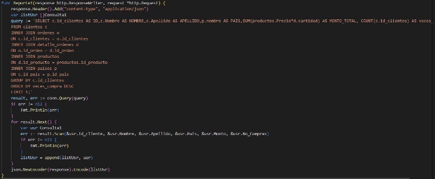

# Informacion Técnica

Esquema Conceptual: 

Esquema Lógico: 

Esquema Físico 

Descripción de tablas: 

Esta base de datos cuenta con 7 tablas con las siguientes descripciones: 

- **Tabla Clientes**: Esta tabla contiene todos los datos del cliente y es una entidad débil, ya que un campo en esta tabla hace referencia a otra tabla para elegir el id del país. 

PK: id\_clientes. 

FK: id\_pais de la tabla Países. 

- **Tabla Ordenes:** Esta tabla contiene las ordenes realizadas en las cuales se especifican los productos, cantidad, vendedor y a que cliente corresponde dicha orden, es una entidad débil. 

**PK:** id\_orden. 

**FK:** id\_cliente de la tabla Clientes. 

- **Tabla Detalle Ordenes:** Esta tabla contiene el detalle de cada orden de la tabla ordenes, esto a través del id de cada orden se generan los detalles, es una entidad débil. 

PK: id 

FK:id\_orden de la tabla órdenes. 

FK:id\_vendedor de la tabla vendedores. 

FK:id\_producto de la tabla productos. 

- **Tabla Vendedores:** Esta tabla contiene la información personal de los vendedores de esta empresa, y también es una entidad débil. 

PK: id\_vendedor. 

FK: id\_pais de la tabla Países. 

- **Tabla Productos:** Esta tabla almacena el stock de productos que se comercializan en esta empresa, es una entidad débil. 

PK: id\_producto. 

FK: id\_categorias. 

- **Tabla Países:** Esta entidad es fuerte ya que no depende de algún campo en otra tabla, en esta tabla se almacenan los países que a lo largo del tiempo se han registrado en el ingreso del personal de ventas y de los clientes. 

PK: Id\_pais 

- **Tabla Categorías:** Esta entidad es de tipo fuerte, y posee la información que, a lo largo del tiempo en el ingreso de productos, se han logrado establecer sus respectivas categorías.  

PK:id\_categorias 

Descripción de la API: 

Este api se realizó con el lenguaje de Golang en su versión 1.18. 

Para la creación de las rutas GET, se utilizó la librería gorilla/mux, la cual ayuda de manera fácil y rápida el poder implementar un servicio de http request, se crearon 10 rutas con el método GET (1 ruta para cada consulta). 

En la conexión con la base de datos, para este caso en especifico se utiliza el DBMS de MYSQL, por ello para lograr la comunicación entre el api y MYSQL fue necesario el uso de la librería “go-sql-driver/mysql” , la cual lleva los siguientes parámetros para su conexión: 

En cada consulta se ingresa un query dentro del método http y para el retorno se crea un struct para genera el formato JSON de acuerdo a lo que deseamos devolver al usuario, a continuación se muestra el struct y la consulta para el reporte 1: 

En este struct como se puede observar contiene 6 campos, debido a que en la requisición de este reporte se solicita que se muestren estos atributos, es por ello por lo que es necesario este struct para poder la información de manera correcta. 

Como se observa en la imagen anterior se ingresa el query dentro del método se hace la requisición a la DB y esta en su respuesta se ingresa al struct correspondiente. 

Endpoint 

Se crearon 10 endpoints, uno para cada reporte respectivamente. Los endpoints utilizados son los siguientes: 

Estos endpoints se encuentra de manera local en el puerto 8000 

## LEVANTAR SERVIDOR 

1. Instalar dependencias 

Para poder levantar el servicio, en primera instancia se deben de ejecutar los siguientes comandos para poder descargar las dependencias que se necesitan en este servidor, los comandos son los siguientes: 

1. Go mod init 

Este comando inicializa el proyecto como modulo, cuando se ejecuta este comando se crea un archivo llamando go.mod que es el que se encarga de llevar un registro de las dependencias. 

2. Go mod tidy 

Este comando se encarga de instalar las dependencias que fueron listadas en el archivo generado a través del comando go mod init. 

2. Levantar Servidor 

El servidor es muy fácil de poder levantarlo, solo se debe de dirigir a la carpeta contenedora del archivo “main.go”  y abrir una terminal desde allí, como se observa en la siguiente imagen: 

Imagen de referencia al achivo main.go 

Se accede desde consola a la ruta del archivo main

Se ingesa el comando go run main.go 

Si todo salió bien, se debe observar el mensaje indicando la conexión exitosa a mysql y el servidor en el puerto 8000 

3. Visualizar Reportes: 

`       `Para visualizar los reportes basta con tener un cliente como postman o incluso desde el navegador web, e ingresar la ruta correspondiente. Esta aplicación cuenta con 10 reportes los cuales se pueden observar con la ruta: 

Localhost:8000/1 (el numero 1 corresponde al numero de reporte, por lo que, si se quiere acceder al reporte 5, únicamente se cambia /5 y así respectivamente para cada ruta). 

Reporte visualizado desde thunderclient 

Desde navegador Firefox 
